# PHF Money Management App

## Overview

PHF Money Manager is an offline-first personal finance management mobile application developed using Flutter.

The application helps users manage their personal finances by tracking accounts, categories, income, expenses, budgets, and financial reports.

The project follows Clean Architecture principles with clear separation between presentation, domain, and data layers.

---

# Features Completed

## Account Management

- Create accounts/wallets
- Update account details
- Delete accounts
- View account balances

## Category Management

- Create income categories
- Create expense categories
- Update and delete categories

## Transaction Management

- Add income transactions
- Add expense transactions
- Edit and delete transactions
- View transaction history

## Dashboard

- Total income calculation
- Total expense calculation
- Current balance calculation
- Recent transaction overview

## Reports

- Income vs expense analysis
- Financial summaries
- Interactive charts

## Settings

- Light/Dark/System theme support
- Currency selection
- Export transaction data
- Reset application data

## Data Persistence

- Offline local storage
- Data remains available after application restart

---

# Technology Stack

## Frontend

- Flutter
- Dart

## State Management

- Riverpod

## Architecture

- Clean Architecture

## Local Storage

- Hive

## Packages Used

- flutter_riverpod
- hive_flutter
- intl
- fl_chart
- go_router
- path_provider
- share_plus
- flutter_launcher_icons

---

# Project Architecture

lib/

├── core/
│ ├── theme/
│ ├── utils/
│ ├── widgets/
│ └── errors/

├── data/
│ └── local/

├── features/
│ ├── accounts/
│ │ ├── data/
│ │ ├── domain/
│ │ └── presentation/

│ ├── categories/
│ ├── transactions/
│ ├── budgets/
│ ├── dashboard/
│ ├── reports/
│ └── settings/

## └── main.dart

# How to Run

## Requirements

- Flutter SDK installed
- Android Studio / VS Code
- Android device or emulator

## Install Dependencies

flutter pub get

## Generate Code (if required)

flutter pub run build_runner build --delete-conflicting-outputs

## Run Application

flutter run

---

# Build APK

Create release APK:

flutter build apk --release

APK location:

build/app/outputs/flutter-apk/app-release.apk

---

# Screenshots

## Splash Screen

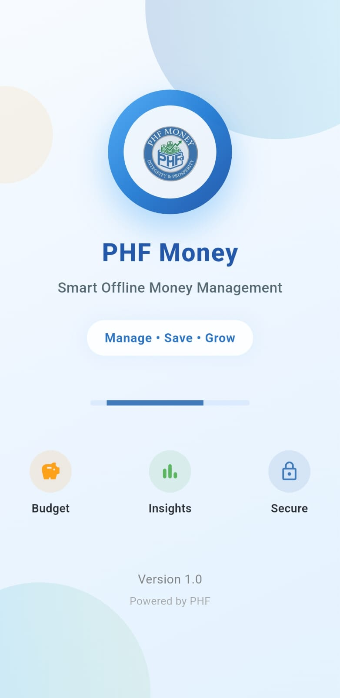

## Dashboard

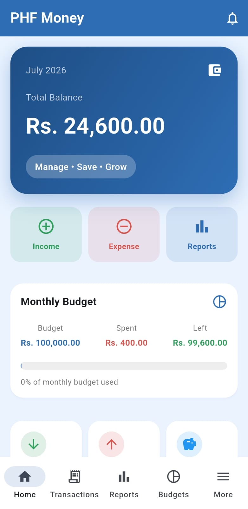

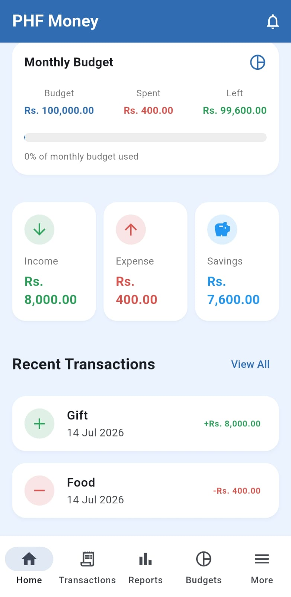

## Transactions

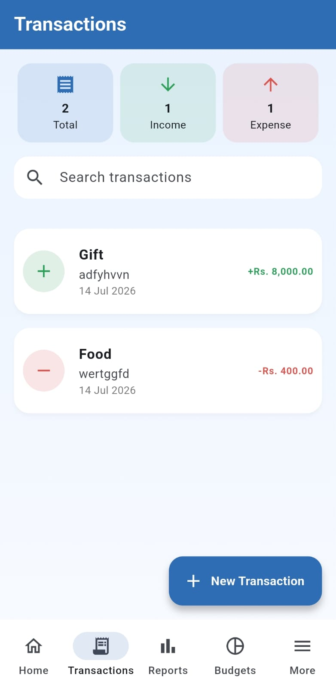

## Add Transaction

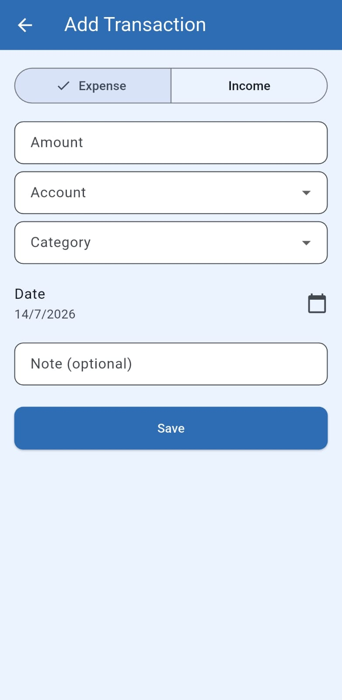

## Accounts

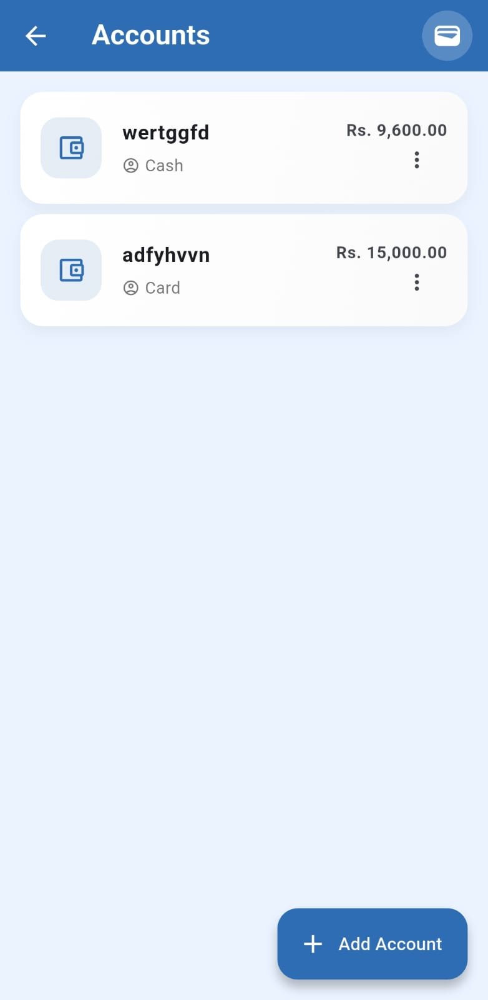

## Categories

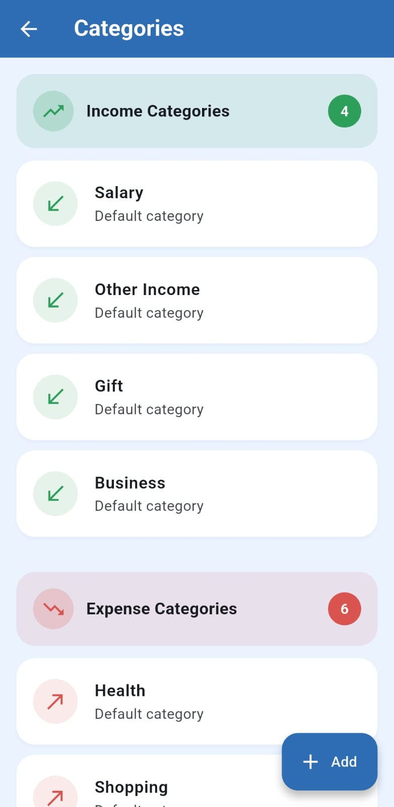

## Budgets

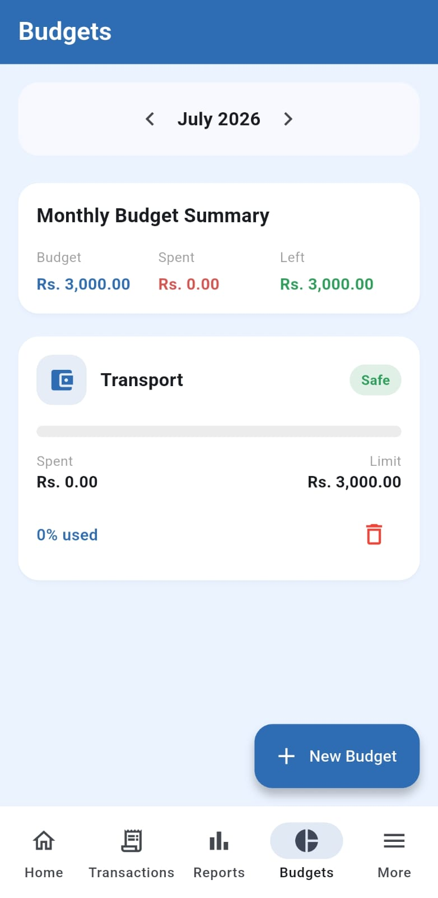

## Reports

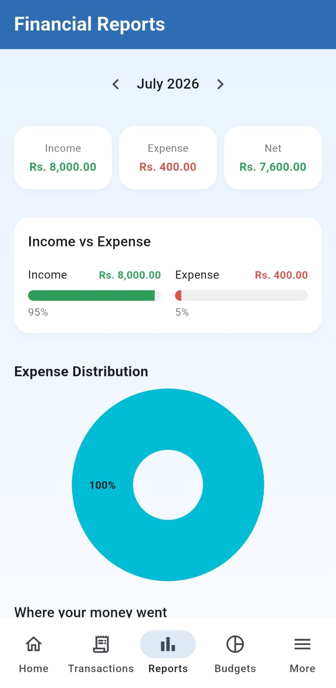

## Settings

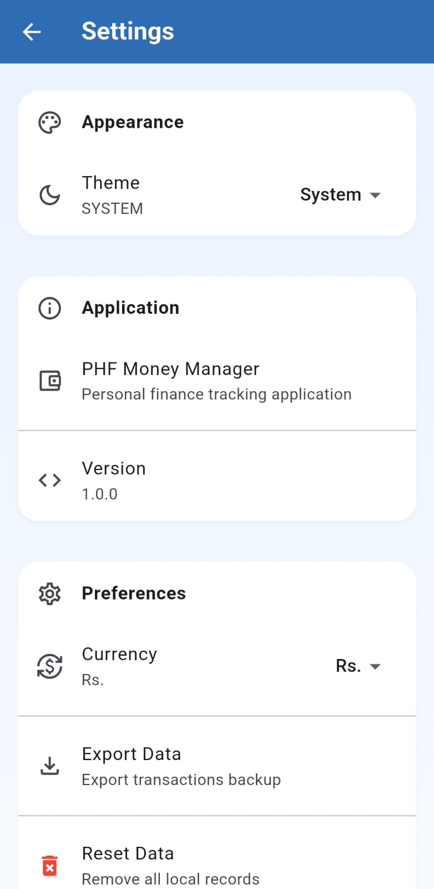

## More

## 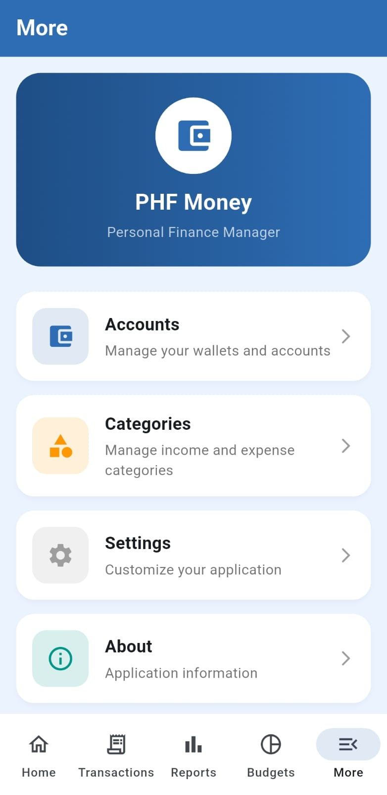

# Testing Notes

Tested Features:

✅ Application launch  
✅ Navigation  
✅ Account CRUD  
✅ Category CRUD  
✅ Transaction CRUD  
✅ Dashboard calculations  
✅ Reports  
✅ Theme switching  
✅ Currency selection  
✅ Export data  
✅ Data persistence after restart

---

# GitHub Repository

Source Code:

https://github.com/DilakshiKeerthirathne/phf_money_app
